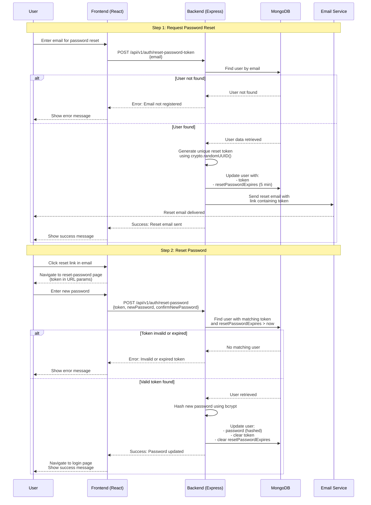
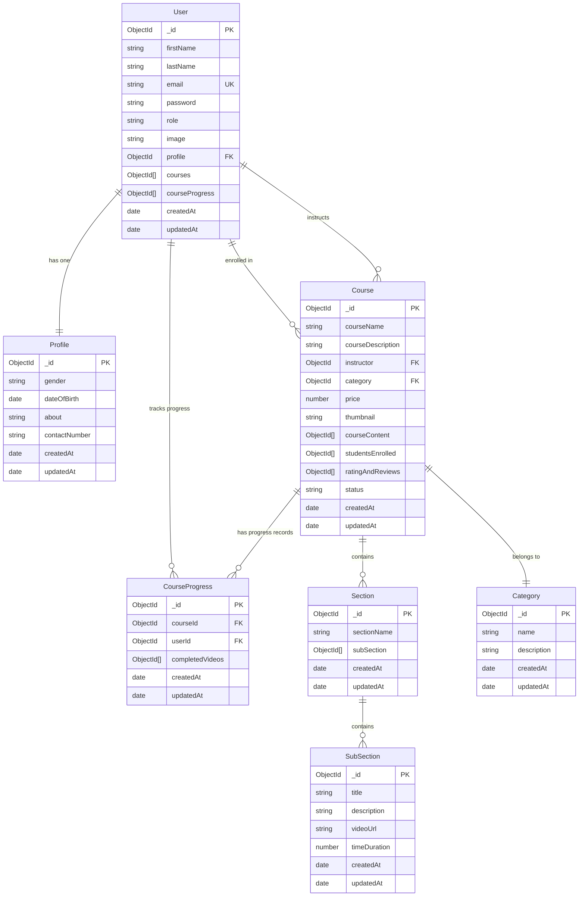

# SkillVerse Flow Diagrams

This document contains comprehensive flow diagrams for the StudyNotion application, showing system architecture and detailed feature flows with API routes and data flow.

## Table of Contents

1. [System Architecture Overview](#system-architecture-overview)
2. [Authentication Flows](#authentication-flows)
   - [Signup with OTP Verification](#signup-with-otp-verification)
   - [Login Flow](#login-flow)
   - [Password Reset Flow](#password-reset-flow)
3. [Course Management Flows](#course-management-flows)
   - [Course Creation Flow](#course-creation-flow)
   - [Course Content Management](#course-content-management)
4. [Student Features](#student-features)
   - [Course Viewing and Progress Tracking](#course-viewing-and-progress-tracking)
   - [Course Enrollment and Payment](#course-enrollment-and-payment)
5. [Profile Management](#profile-management)
6. [Rating and Review System](#rating-and-review-system)

---

## System Architecture Overview

This architecture shows the complete data flow from frontend to backend and external services. The system follows a layered architecture with clear separation of concerns.

---

## Authentication Flows

### Signup with OTP Verification

### Login Flow

### Password Reset Flow

---

## Course Management Flows

### Course Creation Flow

### Course Content Management

---

## Student Features

### Course Viewing and Progress Tracking

### Course Discovery and Enrollment Process

---

## Course Enrollment and Payment

### Payment and Enrollment Flow

### Cart Management Flow

---

## Profile Management

### User Profile Management Flow

### Profile Data Structure Flow

**Profile Management API Endpoints:**
- `GET /api/v1/profile/getUserDetails` - Get user profile information
- `PUT /api/v1/profile/updateProfile` - Update profile details
- `PUT /api/v1/profile/updateDisplayPicture` - Update profile picture
- `GET /api/v1/profile/getEnrolledCourses` - Get user's enrolled courses
- `DELETE /api/v1/profile/deleteAccount` - Delete user account

---

## Rating and Review System

### Rating and Review Flow

### Review System Architecture

### Rating Data Flow

**Rating and Review API Endpoints:**
- `POST /api/v1/course/createRating` - Create a new rating and review
- `GET /api/v1/course/getReviews/:courseId` - Get all reviews for a course
- `GET /api/v1/course/getAverageRating/:courseId` - Get average rating for a course
- `PUT /api/v1/course/updateRating/:reviewId` - Update an existing review
- `DELETE /api/v1/course/deleteRating/:reviewId` - Delete a review

**Business Rules:**
- Users can only review courses they are enrolled in
- Users can only write one review per course
- Rating must be between 1-5 stars
- Users can only edit/delete their own reviews

---

## Summary

This comprehensive flow diagram documentation covers the complete StudyNotion application architecture and feature workflows. Each diagram shows:

1. **System Architecture**: High-level overview of the entire application stack
2. **Authentication**: Complete user signup, login, and password reset flows
3. **Course Management**: Instructor workflows for creating and managing courses
4. **Student Features**: Course discovery, viewing, and progress tracking
5. **Payment System**: Cart management and Razorpay integration
6. **Profile Management**: User profile operations and account settings
7. **Rating System**: Course review and rating functionality

### Key Technologies Covered

- **Frontend**: React, Redux Toolkit, React Router, Tailwind CSS
- **Backend**: Node.js, Express.js, MongoDB, Mongoose
- **Authentication**: JWT tokens, bcrypt password hashing
- **File Storage**: Cloudinary for images and videos
- **Payments**: Razorpay integration
- **Email**: Nodemailer with HTML templates

### API Endpoints Summary

The diagrams include all major API routes used throughout the application:

- **Auth APIs**: `/api/v1/auth/*` (login, signup, sendotp, reset-password)
- **Profile APIs**: `/api/v1/profile/*` (getUserDetails, updateProfile, updateDisplayPicture)
- **Course APIs**: `/api/v1/course/*` (createCourse, addSection, addSubSection, getFullDetailsOfCourse)
- **Payment APIs**: `/api/v1/payment/*` (capturePayment, verifySignature)
- **Rating APIs**: `/api/v1/course/*` (createRating, getReviews, getAverageRating)

Each flow diagram provides detailed insight into the data flow, error handling, and user experience for the StudyNotion learning management system.

